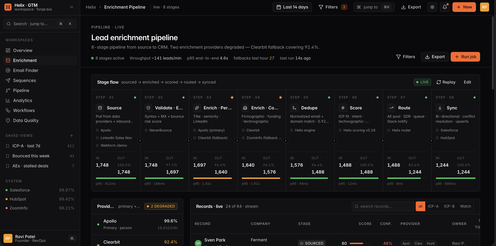

<div align="center">

# Helix

### your GTM best friend

A command center for go-to-market operations — built for founders and RevOps engineers who treat pipeline as a system, not a spreadsheet.

[Quickstart](#quickstart) · [Features](#features) · [Stack](#stack) · [Architecture](#architecture) · [Design system](#design-system)

</div>



---

## Why Helix

Modern GTM is an engineering discipline: enrichment pipelines, outbound automations, CRM syncs, attribution models, and monitoring. Most tools dress this up as marketing software. Helix doesn't.

Helix is a single, dense, keyboard-driven console that gives you the same operational visibility for revenue that you'd expect from a production SRE dashboard — with the polish of a finished product, not a generic admin template.

> This repo is a fully-realized **frontend prototype**. There's no backend; every screen is wired to realistic seeded fixtures so the interactions feel real end-to-end.

## Quickstart

```bash
git clone https://github.com/MihirM9/helix.git
cd helix
npm install
npm run dev          # → http://localhost:5173
```

Other scripts:

```bash
npm run build        # type check + production build
npm run preview      # serve the production build locally
npm run lint         # eslint
```

Press <kbd>⌘</kbd><kbd>K</kbd> anywhere to open the command palette.

## Features

### Eight purpose-built surfaces

| Page | What's inside |
|---|---|
| **Overview** (`/`) | Animated KPI strip with sparklines, pipeline velocity, channel attribution, conversion funnel, "what changed today" activity rail, GTM stack health, alerts, daily sequence volume. |
| **Enrichment** (`/enrichment`) | 8-stage pipeline (source → validate → enrich person → enrich company → dedupe → score → route → sync), provider stack, live records table, lead drawer with score breakdown, firmographics, provenance, and pipeline timeline. |
| **Sequences** (`/sequences`) | Multi-sequence sidebar, step builder with email / LinkedIn / wait / branch nodes, A/B variant comparisons, personalization variables, intent detection, per-step metrics. |
| **Email Finder** (`/finder`) | Bulk email discovery, verification status, deliverability indicators. |
| **Pipeline** (`/pipeline`) | CRM Kanban across 5 stages, per-CRM sync badges, conflict surfacing, deal table with health/sync state, deal drawer with activity timeline and 14-day touch heatmap. |
| **Analytics** (`/analytics`) | Filter chips with motion transitions, conversion funnel, pipeline health radar (6 axes), cohort retention with intensity shading, source attribution, segment velocity, sequence performance. |
| **Workflows** (`/workflows`) | Connected workflow grid, node graph for selected workflow, run log table, full GTM stack provider table (uptime / p95 / success), and a "manual handoffs → automated" before/after column. |
| **Data Quality** (`/data-quality`) | Trust score with weighted dimensions, issue volume mini stack chart, open issues table, 8-monitor grid, broken-automations list. |

### Power-user details

- **Command palette** (<kbd>⌘</kbd><kbd>K</kbd>) — fuzzy search over pages, alerts, and creation flows. Arrow keys + return.
- **Theme** — dark by default; toggle in the top bar, persists in `localStorage`. Tokens live in `src/index.css`.
- **Animated counters** — `useMotionValue`-driven KPIs, color follows delta direction, paired with sparklines.
- **Live status pulses** for active providers and running workflows.
- **Detail drawers** — leads and deals open into full drawers with inline score bars, provenance, and vertical activity timelines.
- **Filter chips** with motion-based add/remove transitions.
- **Cohort table** uses intensity shading for retention readability.
- **Pipeline health radar** with 6 weighted axes.
- **Tabular numerics** everywhere data is shown.

## Stack

- **Vite + React 19 + TypeScript**
- **Tailwind CSS v3** with a custom token system
- **React Router v7** for navigation
- **Recharts** with a custom theme + tooltip
- **Framer Motion** for transitions
- **Lucide** for icons

No backend. All data is seeded in `src/data/fixtures.ts`.

## Architecture

```
src/
├── App.tsx                     # routes
├── main.tsx                    # bootstrap (theme, router)
├── index.css                   # tokens, base, components, utilities
├── lib/
│   ├── theme.tsx               # ThemeProvider · localStorage · system pref
│   └── utils.ts                # cn(), number/currency formatters, seeded random
├── data/
│   └── fixtures.ts             # all demo data (leads, deals, sequences, …)
├── components/
│   ├── Logo.tsx                # custom inline SVG mark
│   ├── PageHeader.tsx          # sticky titlebar with eyebrow + meta + actions
│   ├── charts/
│   │   └── ChartTheme.tsx      # chart color hook + custom Tooltip
│   ├── layout/
│   │   ├── AppShell.tsx
│   │   ├── Sidebar.tsx
│   │   ├── TopBar.tsx
│   │   └── CommandPalette.tsx
│   └── ui/                     # Avatar, Badge, Button, Card, Drawer,
│                               # EmptyState, KPI, Skeleton, Sparkline, StatusDot
└── pages/                      # Overview, Enrichment, Sequences, EmailFinder,
                                # Pipeline, Analytics, Workflows, DataQuality
```

## Design system

- Compact data-UI typography scale — 12.5–13px base, 22px page titles.
- Single accent color: burnt orange (`#EA580C` light, `#FF6421` dark).
- Refined border radii (3–8px) — no overly soft cards.
- Strict spacing on a 4px grid.
- Visible focus rings throughout for keyboard navigation.
- Global `.skeleton` class and pulse keyframes.

## A note on copy

Every string is operational shorthand — *"Sync degraded"*, *"12 records need review"*, *"Reply rate up 18%"*, *"2 providers failing fallback"*. The product reads like an internal tool used every day, because that's what it's pretending to be. No marketing copy. No lorem ipsum.

## License

Prototype / portfolio project. Reach out before reuse.
